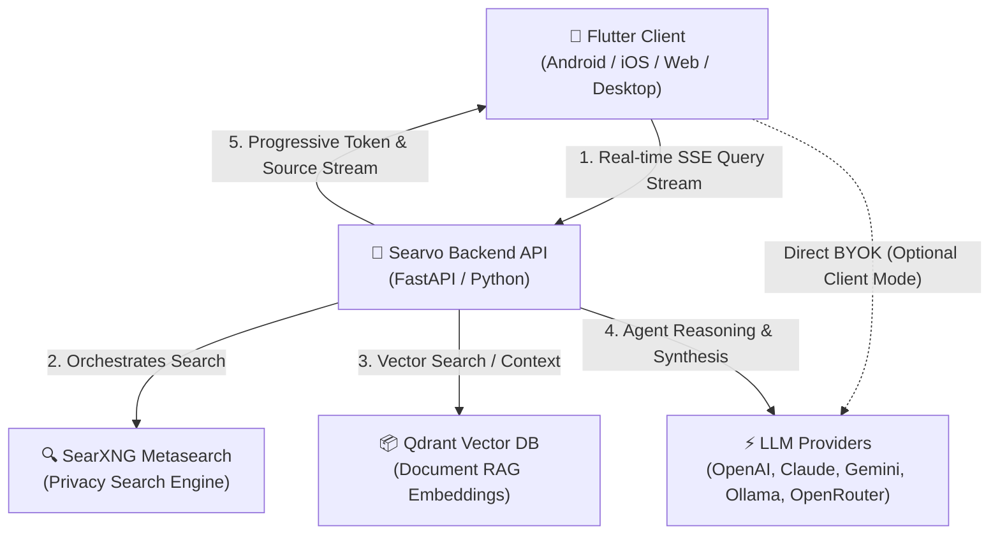

<div align="center">

# 🌐 Searvo

### The Open-Source, Privacy-First AI Search Engine & Autonomous Agent Platform

[](LICENSE)
[](https://flutter.dev)
[](https://fastapi.tiangolo.com)
[](https://python.org)
[](docker-compose.yaml)
[](CONTRIBUTING.md)
[](https://github.com/kamranxdev/searvo/issues?q=is%3Aissue+is%3Aopen+label%3A%22good+first+issue%22)
[](https://discord.gg/Bq67m6NYaa)

<p align="center">
  <strong>Cross-Platform Client • High-Performance Async Backend • Autonomous Agents • Privacy-First Metasearch</strong>
</p>

[Quick Start](#-quick-start) • [Monorepo Architecture](#-monorepo-architecture) • [Features](#-features) • [Contributing](#-contributing) • [Documentation](docs/) • [Community](#-community)

</div>

---

## 🌟 What is Searvo?

**Searvo** is a modern, open-source AI search engine and autonomous reasoning platform. It turns web search into an intelligent, conversational, and agentic experience. By bridging privacy-respecting metasearch engines ([SearXNG](https://github.com/searxng/searxng)) with Retrieval-Augmented Generation (RAG), vector databases ([Qdrant](https://qdrant.tech/)), and Large Language Models, Searvo delivers comprehensive, contextual answers backed by real, verifiable web citations.

### 🚀 Now Fully Open Source!
Searvo is **100% open-source and welcoming contributions across the entire stack**! Whether you are a Flutter/Dart developer, Python/FastAPI enthusiast, AI/RAG engineer, UI/UX designer, or technical writer, we invite you to build the future of open, transparent, and private search with us.

---

## 🏗️ Monorepo Architecture

Searvo is structured as a unified monorepo housing both the client-facing application, the intelligence backend, and supporting containerized infrastructure:

```
searvo/
├── lib/                     # 📱 Frontend: Flutter Cross-Platform Client
│   ├── core/                # Core theme, utilities, error handling, network
│   └── features/            # Feature modules (Clean Architecture)
│       ├── search/          # Search UI, SSE stream consumer, domain logic
│       ├── llm/             # Client-side BYOK LLM integrations & providers
│       ├── voice/           # Speech-to-text and Text-to-speech engine
│       ├── history/         # Local conversation history & bookmarks
│       └── settings/        # App & search provider configuration
│
├── backend/                 # 🧠 Backend: Python FastAPI Intelligence Engine
│   ├── app/
│   │   ├── api/v1/          # REST & SSE streaming endpoints (/search, /discover, /documents)
│   │   ├── services/
│   │   │   ├── agent/       # Autonomous tool-calling agent orchestrator
│   │   │   ├── rag/         # Document chunking, embedding & retrieval pipeline
│   │   │   ├── tools/       # Search, calculator, YouTube, Wikipedia, weather tools
│   │   │   └── llm/         # Unified multi-LLM adapter (OpenAI, Gemini, Claude, Ollama)
│   │   ├── models/          # Pydantic request/response schemas
│   │   └── config.py        # Environment settings & configuration
│   ├── requirements.txt     # Python backend dependencies
│   └── Dockerfile           # Backend container build
│
├── searxng/                 # 🔍 Privacy-first metasearch configuration & dockerfile
├── docs/                    # 📚 Comprehensive technical documentation
├── docker-compose.yaml      # 🐳 Full-stack local orchestration
├── CONTRIBUTING.md          # 🤝 Complete contribution guide for Frontend & Backend
└── LICENSE                  # 📜 MIT Open-Source License
```

### 🧩 How the Pieces Connect


---

## ✨ Features

### 🧠 Autonomous Agent Backend
- **Tool-Calling Reasoning Agent**: Deconstructs complex queries into multi-step actions (web searching, definitions, currency/crypto lookups, YouTube extraction, math calculation).
- **Real-Time Streaming (SSE)**: Streams intermediate agent thoughts, discovered sources, UI widget payloads, and token-by-token syntheses via Server-Sent Events.
- **RAG & Vector Retrieval**: Seamless document ingestion (PDF, DOCX, TXT), semantic chunking, and similarity search powered by Qdrant.
- **SearXNG Privacy Proxy**: Metasearch queries without tracking, cookies, or IP footprint.

### 📱 Cross-Platform Flutter Frontend
- **Universal Multi-Platform**: Runs natively on Android, iOS, Web, macOS, Windows, and Linux.
- **Interactive Markdown & Citations**: Dynamic citation links, collapsible research steps, and interactive widgets.
- **Voice-First Interaction**: Hands-free voice search input (STT) and spoken responses (TTS) in multiple languages.
- **BYOK (Bring Your Own Key)**: Direct client-side provider access or server-routed intelligence. Supports OpenAI, Anthropic Claude, Google Gemini, Ollama, and OpenRouter.
- **Zero Tracking**: 100% privacy-respecting with all query history stored locally on-device.

---

## 🚀 Quick Start

You can run Searvo using Docker (recommended for the full stack) or run each component independently for development.

### Option 1: Full-Stack via Docker Compose (Recommended)

Run SearXNG, Qdrant, Caddy, and the FastAPI Backend in one command:

```bash
# 1. Clone the repository
git clone https://github.com/kamranxdev/searvo.git
cd searvo

# 2. Configure backend environment
cp backend/.env.example backend/.env
# Edit backend/.env to add your preferred LLM API keys (e.g., OPENAI_API_KEY or GEMINI_API_KEY)

# 3. Spin up all services
docker compose up -d

# 4. Verify services:
# - Searvo Backend API: http://localhost:8000/docs
# - SearXNG Gateway:     http://localhost:4000
# - Qdrant Dashboard:    http://localhost:6333/dashboard
```

Then run the Flutter client connected to `http://localhost:8000`!

---

### Option 2: Frontend Development (Flutter)

#### Prerequisites
- [Flutter SDK](https://flutter.dev/docs/get-started/install) 3.8.0 or higher
- [Dart SDK](https://dart.dev/get-dart) 3.8.0 or higher

```bash
# In the repository root
flutter pub get

# Run on your connected device, emulator, or browser
flutter run

# To run in Chrome:
flutter run -d chrome

# Run tests and linter
flutter test
flutter analyze
```

---

### Option 3: Backend Development (FastAPI)

#### Prerequisites
- [Python](https://python.org) 3.10 or higher
- Virtual environment tool (`venv`)

```bash
# Navigate to backend directory
cd backend

# Create and activate virtual environment
python3 -m venv venv
source venv/bin/activate   # On Windows: venv\Scripts\activate

# Install dependencies
pip install -r requirements.txt

# Configure environment variables
cp .env.example .env

# Run development server with auto-reload
uvicorn app.main:app --host 0.0.0.0 --port 8000 --reload
```

Interactive API documentation will be available at:
- **Swagger UI**: [http://localhost:8000/docs](http://localhost:8000/docs)
- **ReDoc**: [http://localhost:8000/redoc](http://localhost:8000/redoc)

---

## 🛠️ Tech Stack

| Layer | Technologies |
|---|---|
| **Frontend Framework** | Flutter 3.8+, Dart 3.8+ |
| **State & Architecture** | Provider, Clean Architecture (Domain / Data / Presentation) |
| **Routing & Networking** | GoRouter, Dio, HTTP |
| **Voice & Media** | `speech_to_text`, `flutter_tts` |
| **Backend Framework** | Python 3.10+, FastAPI, Uvicorn, SSE-Starlette |
| **Agent & LLM Core** | LiteLLM, Custom Autonomous Orchestrator, Pydantic v2 |
| **Search & Scraping** | SearXNG, BeautifulSoup4, yt-dlp, HTTPX |
| **Vector DB & RAG** | Qdrant Client, PyPDF, python-docx |
| **Infrastructure** | Docker, Docker Compose, Caddy |

---

## 🤝 Contributing

We are actively seeking contributors! Whether you want to add a new search tool, design an awesome mobile widget, optimize agent latency, or fix a typo in the documentation, your contribution is celebrated.

### Where Can You Contribute?
- 🎨 **Frontend (Flutter)**: Build beautiful UI components, enhance accessibility, add search filters, or improve the voice interface.
- 🧠 **Backend (Python / FastAPI)**: Create new agent tools (e.g., Wolfram Alpha, GitHub search, Reddit scraper), optimize RAG embeddings, or improve SSE streaming resilience.
- 🔍 **Search & AI**: Fine-tune prompt templates, benchmark multi-provider accuracy, or improve SearXNG query transformation.
- 🐳 **DevOps & Infrastructure**: CI/CD GitHub Actions, Helm charts, Docker optimizations, and automated testing.
- 📝 **Documentation & Localization**: Translations, developer guides, video walkthroughs, and tutorials.

Check out our **[Contributing Guide](CONTRIBUTING.md)** for our step-by-step workflow, style guidelines, and setup instructions.

Explore [Good First Issues](https://github.com/kamranxdev/searvo/issues?q=is%3Aissue+is%3Aopen+label%3A%22good+first+issue%22) to get started immediately!

---

## 🔒 Privacy & Security

Searvo is built around privacy and data sovereignty:
- 🛡️ **No Tracking**: No analytics, trackers, fingerprinting, or user profiling.
- 🔑 **BYOK (Bring Your Own Key)**: You control your credentials. We never log or sell your keys.
- 🕵️ **SearXNG Integration**: Strips tracking headers and cookies from web searches.
- 💾 **Local-First Data**: Conversations and preferences stay on your device unless you choose to self-host.

For security concerns, please review our [Security Policy](SECURITY.md).

---

## 📚 Documentation

Detailed documentation is available in the [`docs/`](docs/) directory:

- 🗺️ **[Monorepo Architecture Guide](docs/architecture/monorepo.md)** - Deep dive into how Frontend & Backend collaborate
- 📱 **[Frontend Architecture](docs/architecture/project-structure.md)** - Flutter Clean Architecture structure
- ⚙️ **[Backend API Reference](backend/README.md)** - FastAPI endpoints & agent tools
- 🚀 **[Installation Guide](docs/getting-started/installation.md)** - Detailed environment setup
- 🤝 **[Contributing Guide](CONTRIBUTING.md)** - Contributor guidelines & code standards
- 👥 **[Contributors](CONTRIBUTORS.md)** - Celebrating our community

---

## 🗺️ Roadmap

- [ ] **Multi-Agent Teams**: Specialized agents for coding, academic research, and deep fact-checking.
- [ ] **Local LLM Mode**: Seamless one-click local inference via Ollama / Llama.cpp.
- [ ] **Browser Extension**: Searvo instant search in Chrome, Firefox, and Safari.
- [ ] **Custom Plugin Ecosystem**: Community-contributed tools and data connectors.
- [ ] **Sync & Backup**: Optional end-to-end encrypted personal sync.

Track our active progress on [GitHub Projects](https://github.com/kamranxdev/searvo/projects).

---

## 💬 Community & Support

- 💬 **[GitHub Discussions](https://github.com/kamranxdev/searvo/discussions)** - Ask questions, showcase setups, and suggest ideas.
- 🐛 **[GitHub Issues](https://github.com/kamranxdev/searvo/issues)** - Report bugs or submit feature requests.
- 💭 **[Discord Community](https://discord.gg/Bq67m6NYaa)** - Chat with maintainers and contributors in real time.

---

## 📜 License

Searvo is open-source software licensed under the **[MIT License](LICENSE)**.

---

<div align="center">

**Built with ❤️ by [Kamran Khan](https://github.com/kamranxdev) and the open-source community.**

[⭐ Star on GitHub](https://github.com/kamranxdev/searvo) • [🍴 Fork Repository](https://github.com/kamranxdev/searvo/fork) • [💬 Join Discord](https://discord.gg/Bq67m6NYaa)

</div>


