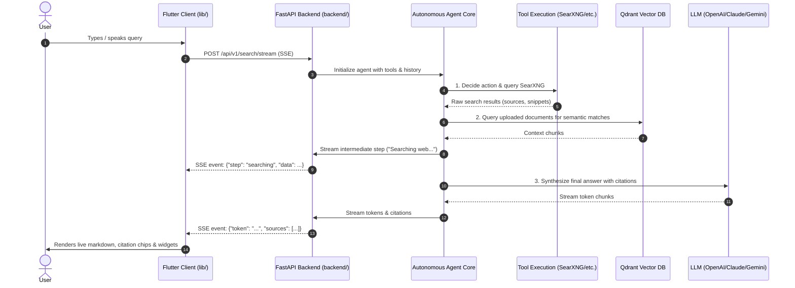

# Searvo Monorepo Architecture

This document provides an in-depth explanation of Searvo's monorepo architecture, describing how the cross-platform Flutter frontend and the asynchronous Python FastAPI backend collaborate to deliver privacy-first, agentic AI search.

---

## 🏛️ System Overview

Searvo is engineered around two complementary components that can either be run together via Docker or developed independently:

```
+---------------------------------------------------------------+
|                      Searvo Monorepo                          |
+---------------------------------------------------------------+
|                                                               |
|  📱 FRONTEND (Flutter)                🧠 BACKEND (FastAPI)    |
|  - Android, iOS, Web, Desktop         - Asynchronous Python   |
|  - Clean Architecture (BLoC/Provider) - Autonomous Agent Core |
|  - Real-Time SSE Stream Consumer      - Tool Execution Engine |
|  - Voice STT & TTS Pipeline           - Qdrant RAG Vector DB  |
|  - Direct BYOK Provider Support       - SearXNG Metasearch    |
|                                                               |
|                              🐳                               |
|        INFRASTRUCTURE & ORCHESTRATION (Docker Compose)        |
|        - SearXNG Privacy Metasearch Gateway (Port 4000)       |
|        - Qdrant Vector Engine (Ports 6333, 6334)              |
|        - Caddy Reverse Proxy & TLS Terminator                 |
|        - Searvo FastAPI Service (Port 8000)                   |
+---------------------------------------------------------------+
```

---

## 🔄 Interaction & Data Flow

### 1. The Autonomous Search Pipeline (`POST /api/v1/search/stream`)

When a user submits a query:



---

## 📁 Monorepo Directory Breakdown

### 1. Frontend: `lib/` (Flutter)
The frontend is organized using **Clean Architecture** principles to isolate UI concerns from network logic:

- `lib/core/`: Application-wide theme constants, error handlers, HTTP base clients, and utility functions.
- `lib/features/search/`:
  - `presentation/`: Search bar, streaming chat UI, citation chips, rich markdown cards, topic feeds.
  - `domain/`: Search entities, search request parameters, stream event contracts.
  - `data/`: `search_data_source.dart` (Server-Sent Events parser over HTTP/Dio), repositories, and DTOs.
- `lib/features/llm/`: Client-side direct provider integration for offline or BYOK mode (OpenAI, Claude, Gemini, Ollama, OpenRouter).
- `lib/features/voice/`: Speech-to-text listener and text-to-speech audio reader.
- `lib/features/history/`: Local persistence for queries, sessions, and bookmarks.
- `lib/features/settings/`: Backend connection settings (URL, ports), theme toggles, and provider selection.

### 2. Backend: `backend/` (FastAPI)
The backend is a lightweight, asynchronous Python service focused on autonomous reasoning:

- `backend/app/main.py`: Application entry point, CORS middleware, lifecycle hooks, and router mounting.
- `backend/app/config.py`: Settings model reading environment variables (`.env`).
- `backend/app/api/v1/routes/`:
  - `search.py`: Streaming agent orchestration (`/search/stream`), raw SearXNG search proxy (`/search/raw`), and query autocomplete.
  - `documents.py`: Document upload (PDF, DOCX, TXT), text chunking, and Qdrant vector indexing.
  - `discover.py`: Curated news and trending topics feed.
  - `health.py`: Live health diagnostics checking connectivity to SearXNG and Qdrant.
- `backend/app/services/`:
  - `agent/`: Orchestrates reasoning steps, plans sub-queries, and handles tool execution callbacks.
  - `rag/`: Embedding generator, vector indexer, and semantic similarity searcher.
  - `tools/`: Modular toolset (web search, calculator, YouTube video info, Wikipedia, weather, crypto/currency).
  - `llm/`: Unified interface supporting multiple model providers using LiteLLM.

### 3. Infrastructure: Root Docker Services
- `docker-compose.yaml`: Runs all backend components in an isolated network (`searvo-network`).
- `searxng/`: Pre-configured SearXNG privacy search engine with bot-detection disabled for internal proxying.
- `caddy.dockerfile` & `Caddyfile`: Reverse proxy for routing search engine traffic.

---

## 🛠️ Developing Across the Boundary

### Adding a New Capability (Example: Adding a GitHub Search Tool)

When adding a full-stack feature, you can follow this monorepo workflow:

1. **Backend**:
   - Create a new tool file in `backend/app/services/tools/github_tool.py`.
   - Register the tool inside `backend/app/services/agent/orchestrator.py`.
   - The tool will automatically be available to the LLM agent during query reasoning!
2. **Frontend**:
   - In `lib/features/search/presentation/widgets/`, create a rich widget to render GitHub repository cards if the backend streams a `widget: github_repo` payload.
3. **Verification**:
   - Run `docker compose up -d` or run `uvicorn app.main:app --reload` locally.
   - Run `flutter run -d chrome` and test your query: *"Find popular Flutter open-source repositories"*.

---

## 🤝 Monorepo Contribution Guidelines

- Keep PRs focused: if a feature touches both Flutter and FastAPI, describe both changes clearly in the PR description using our [PR Template](../../.github/PULL_REQUEST_TEMPLATE.md).
- Follow the respective language formatting guides:
  - Frontend: `flutter analyze` and `dart format .`
  - Backend: `pip install -r requirements.txt` and PEP 8 guidelines.
